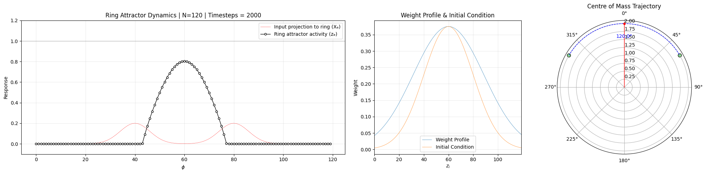

# RING

**Project ID:** aP4kBzQm

<div align="center">
<picture>
  
</picture>
</div>

### Touretzky Ring Attractor
Abstract: *The head direction (HD) system underlies spatial orientation in rodents, yet it can also be conceptualised as a short-term memory mechanism. By maintaining a representation of heading relative to a reference direction, rats track their orientation even in the absence of external cues, with gradual drift reflecting cumulative integration error. Using attractor network models, we explore how such neural dynamics can account for both directional stability and memory, providing a framework for hands-on computational investigations of short-term memory in navigation.*

## Technical Paper
[Attractor Network Models of Head Direction Cells](https://direct.mit.edu/books/edited-volume/2103/chapter-abstract/56474/Attractor-Network-Models-of-Head-Direction-Cells?redirectedFrom=PDF)

## Installation
```
git clone https://github.com/epochlab/RING
```

## Packages
```
pip install -r requirements.txt
```

## Launch
```
bokeh serve --show run_interactive.py
```


## Requirements
- All operating systems are supported. Linux is recommended for performance and compatibility reasons.